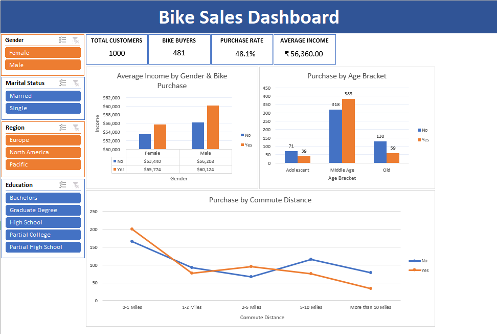

# Bike Sales Analysis & Interactive Excel Dashboard

## Project Overview

This project analyzes customer demographics, income, commute distance, and bike purchasing behavior using Microsoft Excel.

The objective was to transform raw customer data into meaningful business insights and develop an interactive dashboard that allows users to explore purchasing behavior across different customer segments.

---

## Business Objective

The analysis focuses on understanding:

- Customer purchasing behavior
- Bike purchase patterns across different age groups
- Relationship between income and bike purchases
- Bike purchasing behavior by commute distance
- Differences in purchasing behavior across genders
- Customer segments with higher or lower purchase rates

---

## Tools & Technologies

- Microsoft Excel
- PivotTables
- PivotCharts
- Slicers
- KPI Cards
- Excel Formulas
- Data Cleaning & Transformation
- Data Visualization

---

## Data Preparation

The original dataset was preserved in a separate worksheet:

`bike_buyers_master`

A cleaned version of the dataset was prepared in:

`bike_buyers_cleaned`

The cleaned dataset was used as the source for the PivotTables, PivotCharts, KPIs, and interactive dashboard.

The data preparation process included:

- Reviewing the original dataset
- Cleaning and organizing the data
- Preparing fields for analysis
- Ensuring appropriate data types and formatting
- Creating a separate cleaned dataset for analysis
- Using the cleaned data as the source for dashboard development

---

## Interactive Dashboard

The final Excel dashboard contains four dynamic KPI cards:

| KPI | Description |
|---|---|
| Total Customers | Total number of customers in the selected segment |
| Bike Buyers | Number of customers who purchased a bike |
| Purchase Rate | Percentage of customers who purchased a bike |
| Average Income | Average income of the selected customer segment |

All KPI values dynamically update based on the selected slicers.

### Interactive Filters

The dashboard provides the following slicers:

- Gender
- Marital Status
- Region
- Education

These filters allow users to analyze specific customer segments and observe changes in KPIs and visualizations.

### Dashboard Visualizations

The dashboard includes:

1. **Average Income by Gender & Bike Purchase**
2. **Purchase by Age Bracket**
3. **Purchase by Commute Distance**

---

## Key Insights

The dashboard can be used to identify several customer and purchasing patterns:

- Bike purchasing behavior varies across different age groups.
- Average income differs between bike buyers and non-buyers across gender segments.
- Commute distance shows noticeable differences between customers who purchased a bike and those who did not.
- Customer demographics can be used to identify segments with different bike purchase rates.
- Interactive filtering allows deeper analysis of specific customer groups.

### Overall Dataset KPIs

With all filters cleared, the dashboard shows:

| KPI | Value |
|---|---:|
| Total Customers | 1,000 |
| Bike Buyers | 481 |
| Purchase Rate | 48.1% |
| Average Income | ₹56,139.11 |

---

## Dashboard Preview



---

## Project Structure

```text
Excel-Bike-Sales-Dashboard/
│
├── Bike_Sales_Analysis_Dashboard.xlsx
├── dashboard.png
└── README.md
